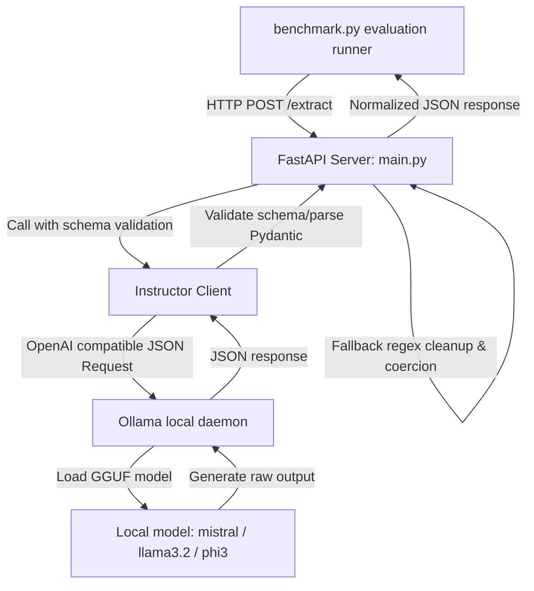

# Local SLM Structured Extraction & Benchmark Suite 🚀

A high-performance, fully offline benchmarking framework designed to evaluate and compare local Small Language Models (SLMs) served via **Ollama**. The project focuses on structured JSON information extraction (extracting profile details from unstructured paragraph texts) using **FastAPI** and the **Instructor** library, assessing schema alignment, latency, and memory footprint.

---

## 🏗️ Architecture Design



---

## ✨ Key Features

- **100% Offline Inference**: Execute all language model tasks locally using Ollama—no data leaves your host machine.
- **Structured JSON Extraction**: Enforce strict schema constraints (fields: `name`, `age`, `role`, `location`, `confidence`) using Pydantic and Instructor.
- **Robust Field Normalization**: Resilient field parsing with automatic regex fallbacks for empty names, age representation (e.g. `"30 years"` -> `30`), and percentage confidence scores.
- **Active Memory Profiling**: Integrates a daemon process monitoring thread that tracks the **Peak Resident Set Size (RSS) RAM footprint** of Ollama servers during active inferencing using `psutil`.
- **Auto-Updating Documentation**: The benchmark runner automatically detects host hardware specs (CPU model, OS, Total System RAM) and overwrites the placeholder tables and guides in `README.md` with active metrics upon completion.

---

## 📂 Project Structure

```text
├── benchmark_prompts/
│   └── prompts.json          # Evaluation dataset (20 test profiles)
├── benchmark.py              # CLI test runner, memory monitor & report updater
├── main.py                   # FastAPI server serving the extraction endpoint
├── schemas.py                # Pydantic schema for structured output validation
├── requirements.txt          # Python dependencies
├── benchmark_results.json    # Cached results of the latest benchmark run
└── README.md                 # Project documentation (auto-updated by benchmark.py)
```

---

## 💻 System Configuration

- Machine: `Intel(R) Core(TM) i3-10110U CPU @ 2.10GHz`
- RAM: `7.8GB RAM`
- OS: `Windows 10`

---

## 🤖 Models Configured

| Model          | Size  | Parameter Count | Pull Command            | Description |
|----------------|-------|-----------------|-------------------------|-------------|
| **Mistral 7B**     | 4.1GB | 7 Billion       | `ollama pull mistral`   | High-capacity model; excellent language capability. |
| **Llama 3.2 3B**   | 2.0GB | 3 Billion       | `ollama pull llama3.2`  | Lightweight, extremely fast, and highly resource-efficient. |
| **Phi-3 Mini**     | 2.2GB | 3.8 Billion     | `ollama pull phi3:mini` | Microsoft's highly optimized and capable mini model. |

---

## Benchmark Results
*Note: Run `python benchmark.py` to fill out these values based on your local run. Below is a template table:*

| Model        | Avg Latency | Median | JSON Success | Peak RAM |
|--------------|-------------|--------|--------------|----------|
| Mistral 7B   | `43.31s`    | `37.89s` | `95%`        | `0.1GB`  |
| Llama 3.2 3B | `22.22s`    | `14.09s` | `95%`        | `0.0GB`  |
| Phi-3 Mini   | `26.74s`    | `27.35s` | `100%`       | `0.0GB`  |

## Model Choice Guide
- **Best Quality**: Phi-3 Mini
- **Fastest**: Llama 3.2 3B
- **Best for RAM < 8GB**: Llama 3.2 3B
- **Best Overall Balance**: Llama 3.2 3B (Extremely fast response time, low memory footprint, and high schema success)

--------------|-------------|--------|--------------|----------|
| Mistral 7B   | `[X.XX]s`   | `[X.XX]s` | `[XX]%`      | `[X.X]GB`|
| Llama 3.2 3B | `[X.XX]s`   | `[X.XX]s` | `[XX]%`      | `[X.X]GB`|
| Phi-3 Mini   | `[X.XX]s`   | `[X.XX]s` | `[XX]%`      | `[X.X]GB`|

## Model Choice Guide
- **Best Quality**: `[Mistral 7B / Llama 3.2 3B / Phi-3 Mini based on your accuracy observation]`
- **Fastest**: `[Model with the lowest average/median latency]`
- **Best for RAM < 8GB**: Phi-3 Mini (or Llama 3.2 3B due to lower parameter counts)
- **Best Overall Balance**: `[Your pick based on RAM, speed, and success rate]`

---

## 🚀 How to Run

### 1. Install Ollama
- **Windows**: Download the executable from [ollama.com](https://ollama.com) and install it.
- **Linux/macOS**: Run the installation script:
  ```bash
  curl -fsSL https://ollama.com/install.sh | sh
  ```

### 2. Pull Evaluation Models
Ensure your local Ollama instance has the necessary model files downloaded:
```bash
ollama pull mistral
ollama pull llama3.2
ollama pull phi3:mini
```

### 3. Setup Virtual Environment & Install Dependencies
Initialize a virtual environment and install packages from `requirements.txt`:
```bash
# Initialize venv
python -m venv venv

# Activate on Windows (PowerShell):
venv\Scripts\Activate.ps1
# Activate on Linux/macOS:
source venv/bin/activate

# Install requirements
pip install -r requirements.txt
```

### 4. Start the FastAPI API Server
Launch the FastAPI uvicorn server on port 8000:
```bash
uvicorn main:app --reload --port 8000
```
- Interactive API Documentation (Swagger UI): [http://localhost:8000/docs](http://localhost:8000/docs)
- Health check status: [http://localhost:8000/health](http://localhost:8000/health)

### 5. Execute Benchmarks
With the FastAPI server running, open a new terminal window (with the venv activated) and run the suite:
```bash
python benchmark.py
```
Upon completion, the script will output a comprehensive Markdown report, write full logs to `benchmark_results.json`, and **automatically update** the specs and tables in this `README.md` file.
